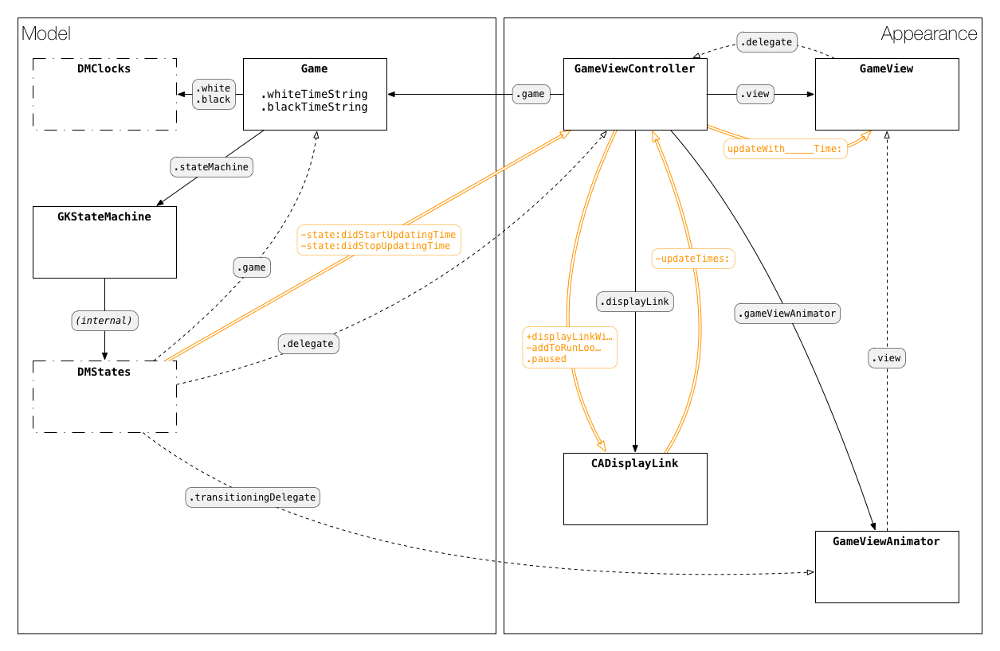
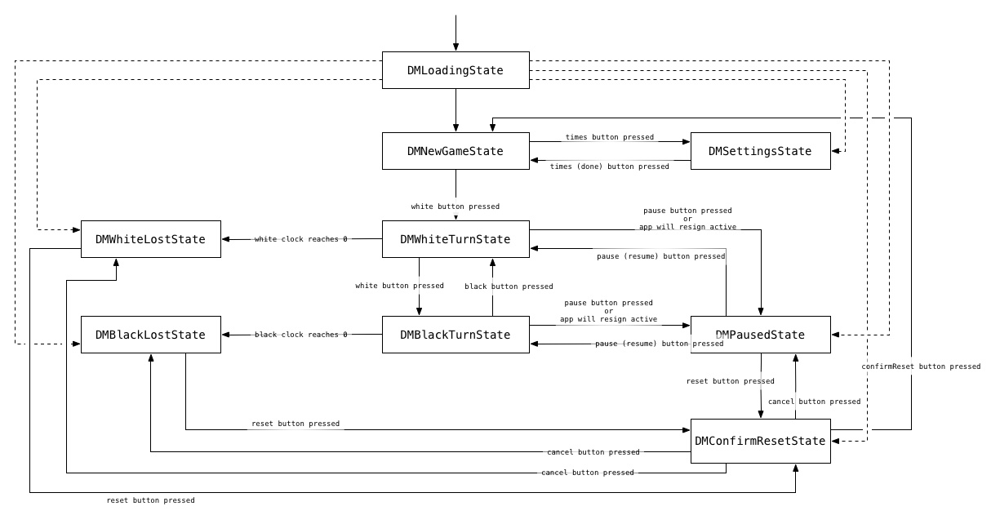

# chessclock: A game timer for iOS

chessclock is [a game timer](https://en.wikipedia.org/wiki/Chess_clock) for
iOS. You can use a game timer for two-player games like **chess** or **go**, to
ensure you and your opponent get a fair amount of time in which to take your
turns. Hit your button to end your turn; when a player's clock reaches 0, they
lose.

## Developing

chessclock is written in Objective-C, and linked against iOS 9.2. It has no
dependencies beyond the iOS system libraries. It is pretty straightforward.

## Wait, Why Is This Thing On Github

Exploration.

The first version worked great, with a clean design and touches of animation,
but was horrible underneath: all the view animation logic and (half-baked)
state tracking in one Massive View Controller. It hurt.

So I made a proper state machine for the UI (using [GKStateMachine][1]),
abstracted the state transitions to a protoocol, and separated many concerns.

I haven't seen anyone discussing user interface state machines in iOS, so
making my implementation public is the first step to making that discussion
exist on the Internet. Hopefully it will be useful.

## So How Is It Structured

Here is a hand-wavey diagram of the current classes, made while figuring out a
better flow of method calls for updating the times:

* Solid black boxes are classes (Note: not all class names are correct, for
  some reason `:/`)
* Dotted/dashed boxes are, vaguley, "collections" -- there are two `DMClock`s and
  several `DMState`s)
* Grey text boxes on arrows are property/method names
* Solid black arrows are `strong` properties
* Dashed arrows are `weak` properties
* Orange text and arrows are the flow of method calls for updating the time

## And What Is The State Machine You Keep Mentioning

This diagram shows the user interface states:

* Boxes are states
* Solid arrows are regular state transitions, initiated by user input or
  logical conditions (i.e. timer running out)
* Text on transitions arrows is a description of the user input or conditions
  which will cause the transition to occur
* Dashed arrows are direct transitions from initial app loading state, to
  support restoring the complete app state (particularly UI) if the app gets
  killed (**NOTE: this feature isn't implemented yet**)

## So Now What

There's clearly more to say about this approach, and the issues of
encapsulation and where responsibilities lie. I hope to actually write that;
for now, this at least documents the thing itself.

If you have questions, bug reports, pull requests, or anything else, please let
me know in an Issue or a Pull Request!

[1]: https://developer.apple.com/library/mac/documentation/GameplayKit/Reference/GKStateMachine_Class/index.html

